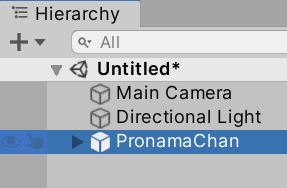
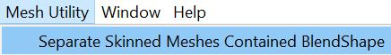
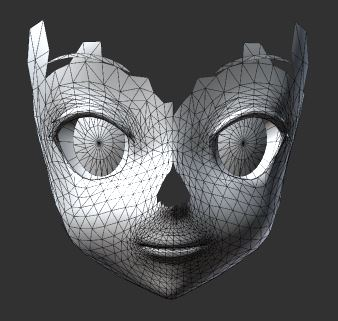

# MeshSeparator

MeshSeparator provides a functionality of separating meshes contained BlendShape. Simply select a GameObject with skinned Meshes and click processing. The mesh splitting results are generated in the Assets folder. The model with sparse BlendShape data distributed in a large-volume mesh can be benefited from size reduction and performance improvements after mesh separation.  

## How to use

Select a GameObject contained skinned mesh and BlendShape:

Select `Mesh Utility` -> `MeshSeparator`:

The separate meshes are saved in the Assets folder. GameObjects with separate meshes are also available in the Hierarchy Window:

In this example, the model's mesh are split into two parts: face and body:

Face: with BlendShape      | Body: without BlendShape
:-------------------------:|:-------------------------:
  | 

Note that if all the polygons of a mesh are used by BlendShape, MeshSeparator will not perform mesh separation.