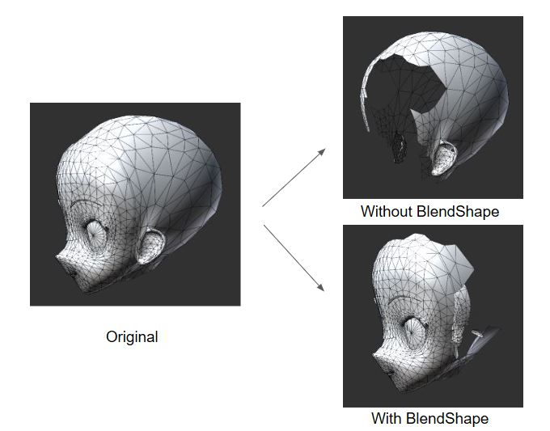
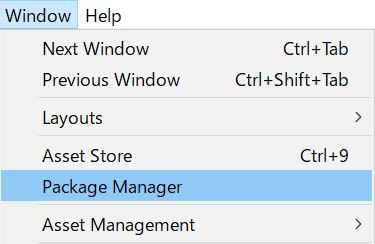
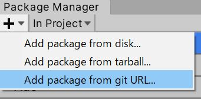

# MeshUtility

Mesh processing tool in Unity platform.

## Utilities

### MeshSeparator

Separate the target mesh into different categories based on given conditions.

Currently support BlendShape mesh separation. See [documentation](Documentation/notes/MeshSeparator.md) for more details.



### MeshIntegrator

Integrate all the meshes of a Prefab (Project window).

### Integrate Static Mesh

Integrate all the static meshes in the Hierarchy (Root and its children).

### MeshNormalizer

Bake the Hierarchy. This is VRM normalize backend.
MeshNormalizer can do blendShape bake.

## Import MeshUtility

There are two ways to import MeshUtility into a Unity project.

### 1. Unity Package Manager (from Unity 2019)

You can add MeshUtility package via `UPM`. First click `Window` from menu on top, then select `Package Manager`.



In `Package Manager`, click `Add package from git URL` and paste `https://github.com/vrm-c/UniVRM.git?path=/Assets/MeshUtility`.



Now check your project window. You shall see MeshUtility in the `Packages` folder.

### 2. Add package name and its url in manifest.json

Another way of importing MeshUtility is manually adding necessary information in manifest.json, which is in the directory of `Package folder` in your Unity project. Open manifest.json with text editor and add the followings in `dependencies`:

```json
{
  "dependencies": {
    "com.vrmc.meshutility": "https://github.com/vrm-c/UniVRM.git?path=/Assets/MeshUtility",
  }
}
```

Go back to the Unity project. The system will automatically load the package.

