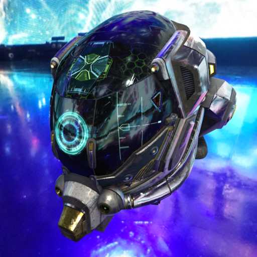
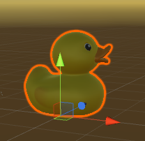
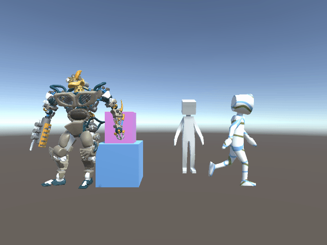
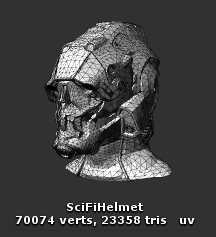

# UniGLTF-2.0

* Unity-Supports 2019.4 and later
* You can import and export glTF-2.0 in Unity's editor and runtime.
* implement `KHR_materials_unlit`
* implement `KHR_texture_transform` (partial)

# Material

## PBR

* Convert as much as possible between glTF pbr and Unity Standard Shader.
* Converts metal roughness and occlusion RGBA channel incompatibility.

### GltfCompatible import (UniGLTF/UniGltfPbr)

* Optionally, glTF pbr materials can be imported into the render pipeline independent `UniGLTF/UniGltfPbr` ShaderGraph (Built-In / URP) instead of Standard / URP-Lit. This path keeps glTF semantics as-is (no ORM channel conversion, metallic/roughness factors unchanged).
  * Editor import: set `Pbr Material Import Type` to `GltfCompatible` on the gltf/glb importer inspector.
  * Runtime import: `GltfUtility.LoadAsync(path, awaitCaller, MaterialDescriptorGeneratorUtility.GetValidGltfMaterialDescriptorGenerator(PbrMaterialImportType.GltfCompatible))`
* For player builds with runtime import, add `UniGLTF/UniGltfPbr` to `Project Settings > Graphics > Always Included Shaders` (as with `UniGLTF/UniUnlit`).
* See `Packages/UniGLTF/UniGltfPbr/SPEC.md` for the shader specification.

## Unlit

* import: UniGLTF's own `UniGLTF/UniUnlit` shader.
* export: You can export `UniGLTF/UniUnlit` and Unity unilt materials.

* Only `UniGLTF/UniUnlit` supports vertex colors.

## URP

* import only. experimental

# License

* [MIT license](LICENSE)

# Download

* https://github.com/vrm-c/UniVRM/releases

# Screenshots

You can import almost all of [gltf_sample_models](https://github.com/KhronosGroup/glTF-Sample-Models/tree/master/2.0)

