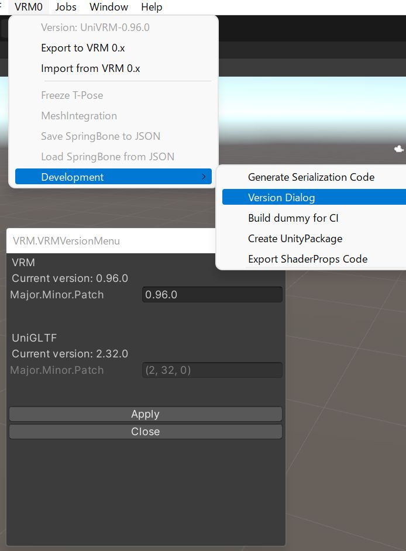

# リリース作業手順

## リリース番号を決める。

`vX.Y.Z`

## ライブラリのバージョンを上げる

`VRM0-development-Version Dialog` によりバージョンを上げる。



branch: `version/vX_Y_Z`
commit: `UniVRM-X.Y.Z`
PR
merge

## UnitTest をすべて実行する

all green

## Build確認

`VRM0-development-Dummy build for CI` により `#if UNITY_EDITOR` などでビルド時のみに起きるエラーが無いことｗ確認する

## unity package 作成

`VRM0-development-Create Unity Package` により unity package を作成する

* UniVRM
* UniVRM-Sample
* VRM
* VRM-Sample

の４パッケージ

## リポジトリにタグを打つ

`vX.Y.Z`

### tag 打ち

```
$ git tag vX.Y.Z # local
$ git push upstream --tags # remote
```

### tag 消し

```
$ git tag -d vX.Y.Z # local
$ git push upstream :vX.Y.Z # remote
```

## github で tag からリリースを作成して draft で保存する。

* unity package をアップロード

## 動作確認

* unity package の動作確認
* UPM の動作確認

## リリース記事

* `/doc/release_gen.py`
    * release の記事をコピペ
    * sphinx の release 記事が生成されるので、必用であれば手を入れてコミット、push(`doc/vX_Y_Z`: `release vX.Y.Z`)、merge
* github release を draft から publish
